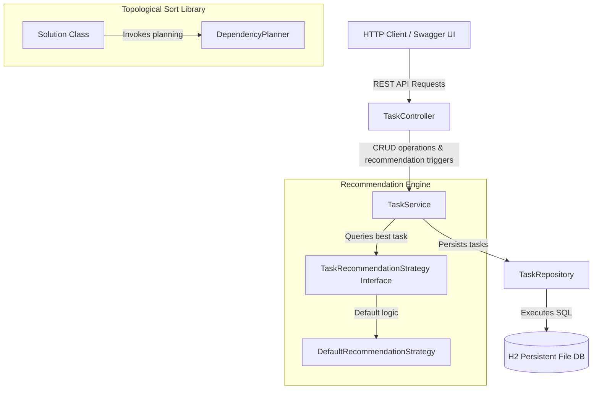
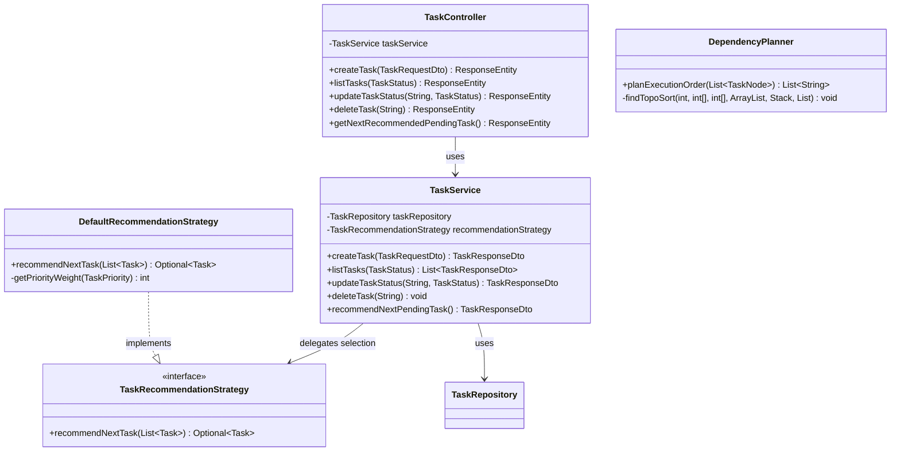

# Overt Ideas and Solutions - Software Developer Technical Assessment

A clean, production-ready implementation of the technical assessment using **Java 17** and **Spring Boot 3.3.2**.

---

## Architecture Design

### High-Level Architecture (HLD)

The system consists of two primary modules: the pure dependency-free algorithms module (**Part A**) and the web service module (**Part B**).



### Low-Level Design (LLD)



---

## Strategy & Factory Pattern Extensibility Guidelines

Currently, the application implements the **Strategy Pattern** where `TaskService` delegates task recommendation decisions to the `TaskRecommendationStrategy` abstraction.

### Scaling to the Strategy Factory Pattern

If the system requirements grow to support multiple recommendation strategies dynamically at runtime (e.g., Shortest-Job-First, Resource-Capacity-Based) triggered by API users, you can scale this to a **Strategy Factory** pattern without modifying `TaskService` core logic:

1. **Add identifier to Strategy**:
   ```java
   public interface TaskRecommendationStrategy {
       Optional<Task> recommendNextTask(List<Task> pendingTasks);
       String getStrategyType(); // e.g., "DEFAULT", "SJF"
   }
   ```

2. **Implement a Factory**:
   ```java
   @Component
   public class TaskRecommendationStrategyFactory {
       private final Map<String, TaskRecommendationStrategy> strategies;

       public TaskRecommendationStrategyFactory(List<TaskRecommendationStrategy> strategyList) {
           this.strategies = strategyList.stream()
               .collect(Collectors.toMap(s -> s.getStrategyType().toUpperCase(), s -> s));
       }

       public TaskRecommendationStrategy getStrategy(String type) {
           return strategies.getOrDefault(type.toUpperCase(), strategies.get("DEFAULT"));
       }
   }
   ```

3. **Inject the Factory into `TaskService`**:
   `TaskService` can resolve strategies dynamically:
   ```java
   TaskRecommendationStrategy strategy = strategyFactory.getStrategy(clientRequestedType);
   ```

---

## Rationale & Complexity Analysis

### Part A - Topological Sort Complexity
We implemented topological sorting using a depth-first search (DFS) with a visited array (`vis`) and a loop-checking recursion stack array (`visiting`):
- **Time Complexity**: $\mathcal{O}(V + E)$, where $V$ is the number of tasks and $E$ is the number of dependencies.
- **Space Complexity**: $\mathcal{O}(V + E)$ to store the adjacency list representation, the recursion stack, and the index maps.

### Part B - Deterministic Recommendation Engine
The recommendation engine sorts pending tasks by:
1. **Priority**: `CRITICAL` > `HIGH` > `MEDIUM` > `LOW`.
2. **Due Date**: Earliest first (nulls sorted last).
3. **Creation Time**: Oldest created tasks first.

---

## Setup and Running Instructions

### Prerequisites
- JDK 17 must be installed and configured on your system.

### 1. Compile and Run Tests
To run all 26 automated unit and integration tests:
```bash
./mvnw clean test
```

### 2. Run the Spring Boot Server
To start the REST API on port `8080`:
```bash
./mvnw spring-boot:run
```

### 3. Verify Endpoints & Interactive API Docs
- **Swagger UI**: [http://localhost:8080/swagger-ui/index.html](http://localhost:8080/swagger-ui/index.html)
- **H2 Database Console**: [http://localhost:8080/h2-console](http://localhost:8080/h2-console) (JDBC URL: `jdbc:h2:file:./data/tasksdb`, Username: `sa`, Password: `password`).
