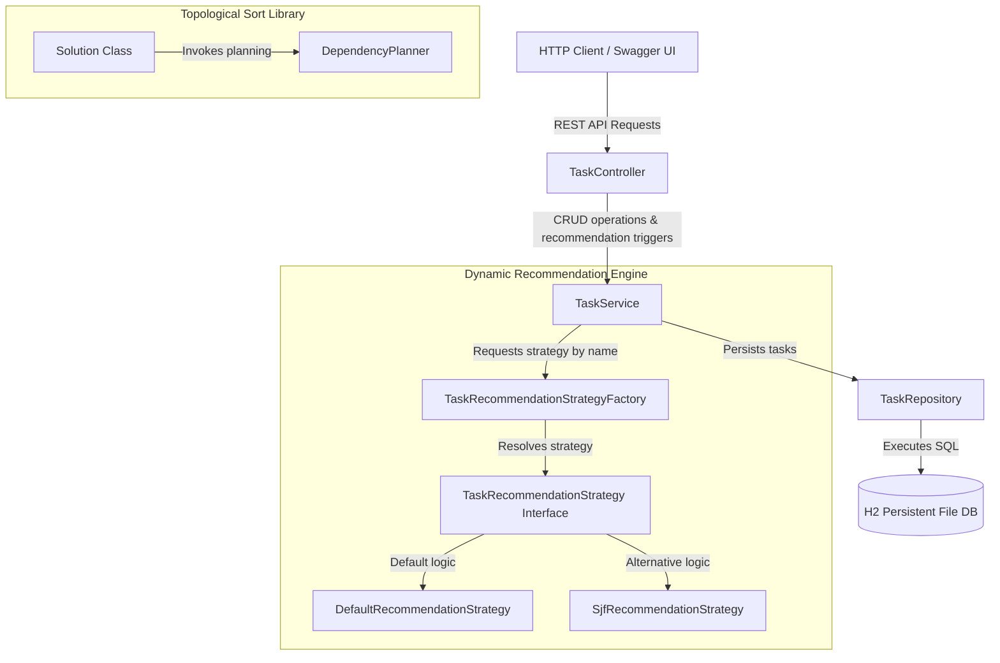
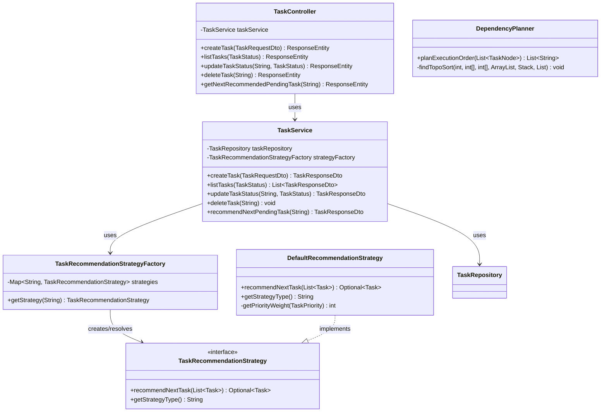

# Overt Ideas and Solutions - Software Developer Technical Assessment

A clean, production-ready implementation of the technical assessment using **Java 17** and **Spring Boot 3.3.2**.

---

## Architecture Design

### High-Level Architecture (HLD)

The system consists of two primary modules: the pure dependency-free algorithms library (**Part A**) and the REST web service module (**Part B**).



### Low-Level Design (LLD) with Factory Integration



---

## Complexity Analysis (Time & Space)

### Part A - Topological Sort
We implemented topological sorting using a depth-first search (DFS) with a visited array (`vis`) and a loop-checking recursion stack array (`visiting`):
- **Time Complexity**: $\mathcal{O}(V + E)$, where $V$ is the number of tasks and $E$ is the number of dependencies. We visit each task once, and scan its dependency edges once.
- **Space Complexity**: $\mathcal{O}(V + E)$ to store the adjacency list representation, the recursion stack, and the index translation maps.

### Part B - Smart Task Queue API
The recommendation engine retrieves pending tasks and sorts them:
- **Time Complexity**:
  - **CRUD Operations (Create, Update, Delete)**: $\mathcal{O}(1)$ average lookup and writes using database indexes on the primary key.
  - **Next Task Recommendation**: $\mathcal{O}(N \log N)$ where $N$ is the number of pending tasks (due to sorting the tasks using the deterministic comparator).
- **Space Complexity**:
  - **Memory Space**: $\mathcal{O}(N)$ where $N$ is the number of pending tasks loaded into memory for processing.
  - **Database Storage**: $\mathcal{O}(T)$ where $T$ is the total tasks stored in the H2 file database.

---

## API Documentation

Below is the specification of the REST API endpoints. You can also view and test these interactively via the built-in Swagger UI.

### 1. Create Task
- **Route**: `POST /api/tasks`
- **Request Body**:
  ```json
  {
    "id": "task-1",
    "title": "Build API",
    "priority": "HIGH",
    "status": "PENDING",
    "dueDate": "2026-08-15T18:00:00",
    "estimatedHours": 4.5
  }
  ```
- **Responses**:
  - `201 Created`: Returns the created task entity with a generation timestamp.
  - `400 Bad Request`: Validation failure (e.g. blank title) or duplicate task ID.

### 2. List Tasks (with optional Status Filter)
- **Route**: `GET /api/tasks?status=PENDING`
- **Request Parameters**:
  - `status` (Optional): Filter tasks by state (`PENDING`, `IN_PROGRESS`, `COMPLETED`).
- **Responses**:
  - `200 OK`: Returns an array of tasks.

### 3. Update Task Status
- **Route**: `PATCH /api/tasks/{id}?status=IN_PROGRESS`
- **Responses**:
  - `200 OK`: Returns the updated task.
  - `404 Not Found`: Task with the specified ID does not exist.

### 4. Delete Task
- **Route**: `DELETE /api/tasks/{id}`
- **Responses**:
  - `204 No Content`: Task deleted successfully.
  - `404 Not Found`: Task does not exist.

### 5. Get Next Recommended Pending Task
- **Route**: `GET /api/tasks/next-recommended?strategy=DEFAULT`
- **Request Parameters**:
  - `strategy` (Optional): Name of the sorting algorithm to run (defaults to `DEFAULT`).
- **Responses**:
  - `200 OK`: Returns the highest-priority pending task based on deterministic sorting rules.
  - `404 Not Found`: No pending tasks exist.

---

## Setup and Running Instructions

### Prerequisites
- JDK 17 must be installed and configured on your system.

### 1. Compile and Run Tests
To run all 26 automated unit and integration tests:
```bash
./mvnw clean test
```

### 2. Run the Spring Boot Server
To start the REST API on port `8080`:
```bash
./mvnw spring-boot:run
```

### 3. Verify Endpoints & Interactive API Docs
- **Swagger UI**: [http://localhost:8080/swagger-ui/index.html](http://localhost:8080/swagger-ui/index.html)
- **H2 Database Console**: [http://localhost:8080/h2-console](http://localhost:8080/h2-console) (JDBC URL: `jdbc:h2:file:./data/tasksdb`, Username: `sa`, Password: `password`).
